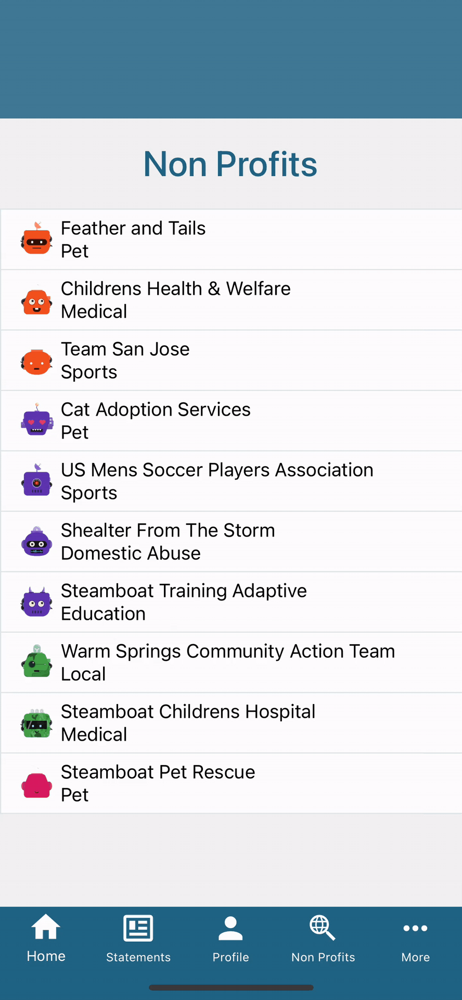

[](https://groundswell.io)

#### Groundswell unlocks philanthropic giving at scale by making charity an employee benefit, giving people the power of a personal foundation in the palm of their hand: a 401K for giving.

## Tech

Packages used:

- [React Native] - Create native apps for Android and iOS using React
- [React Navigation] - Routing and navigation for Expo and React Native apps
- [Redux] - State Management.

## Installation

Groundswell requires Xcode and cocoapods for iOS, Android requires Android Studio and Java SDK 8 or 14.

Install the dependencies.

```sh
jar xf <file-name>.zip
cd FE-Test-main
yarn

#iOS
yarn ios:pod
yarn ios

#Android
yarn android
```

Login Details

```sh
test@groundswell.io
Temp1234!
```

## Instructions

Sign in (using the credentials provided)

1. Add a new tab to the bottom tab navigation
2. Create a screen for the new tab that reachs out to 'https://gs.npkn.net/npo' (axios is already in the dependencies )
3. Display the list of Non Profit Organizations that are returned
4. Tapping on an NPO should navigate to a screen that displays the avatar,name,type, and description

See app/assets/screenshots for a rough mockup, feel free to add your own style to it



## License

None, implied or granted.

[react native]: https://reactnative.dev
[react navigation]: https://reactnavigation.org
[redux]: https://redux.js.org
[typescript]: https://www.typescriptlang.org/
[detox]: https://github.com/wix/Detox/blob/master/docs/README.md
